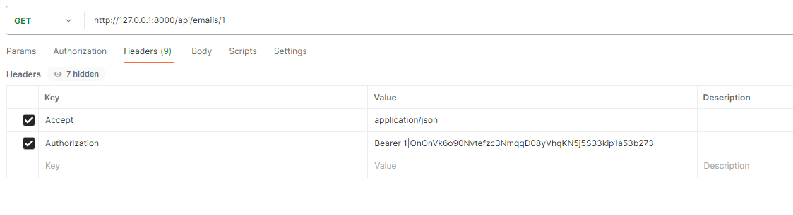

<p align="center"><a href="https://laravel.com" target="_blank"></a></p>

<p align="center">
<a href="https://github.com/laravel/framework/actions"></a>
<a href="https://packagist.org/packages/laravel/framework"></a>
<a href="https://packagist.org/packages/laravel/framework"></a>
<a href="https://packagist.org/packages/laravel/framework"></a>
</p>

## About Laravel

Laravel is a web application framework with expressive, elegant syntax. We believe development must be an enjoyable and creative experience to be truly fulfilling. Laravel takes the pain out of development by easing common tasks used in many web projects, such as:

- [Simple, fast routing engine](https://laravel.com/docs/routing).
- [Powerful dependency injection container](https://laravel.com/docs/container).
- Multiple back-ends for [session](https://laravel.com/docs/session) and [cache](https://laravel.com/docs/cache) storage.
- Expressive, intuitive [database ORM](https://laravel.com/docs/eloquent).
- Database agnostic [schema migrations](https://laravel.com/docs/migrations).
- [Robust background job processing](https://laravel.com/docs/queues).
- [Real-time event broadcasting](https://laravel.com/docs/broadcasting).

Laravel is accessible, powerful, and provides tools required for large, robust applications.

## Learning Laravel

Laravel has the most extensive and thorough [documentation](https://laravel.com/docs) and video tutorial library of all modern web application frameworks, making it a breeze to get started with the framework.

You may also try the [Laravel Bootcamp](https://bootcamp.laravel.com), where you will be guided through building a modern Laravel application from scratch.

If you don't feel like reading, [Laracasts](https://laracasts.com) can help. Laracasts contains thousands of video tutorials on a range of topics including Laravel, modern PHP, unit testing, and JavaScript. Boost your skills by digging into our comprehensive video library.

## Laravel Sponsors

We would like to extend our thanks to the following sponsors for funding Laravel development. If you are interested in becoming a sponsor, please visit the [Laravel Partners program](https://partners.laravel.com).


## Contributing

Thank you for considering contributing to the Laravel framework! The contribution guide can be found in the [Laravel documentation](https://laravel.com/docs/contributions).

## Code of Conduct

To ensure that the Laravel community is welcoming to all, please review and abide by the [Code of Conduct](https://laravel.com/docs/contributions#code-of-conduct).

## Security Vulnerabilities

If you discover a security vulnerability within Laravel, please send an e-mail to Taylor Otwell via [taylor@laravel.com](mailto:taylor@laravel.com). All security vulnerabilities will be promptly addressed.

## License

The Laravel framework is open-sourced software licensed under the [MIT license](https://opensource.org/licenses/MIT).

# Backend Engineering Assessment With PHP Laravel

## Email Parser

### Requirements

- PHP 8.x
- Laravel 10
- MySQL
- Composer
- sanctum 3.3

## Installation locally
1. Run the following command to install the project locally
2. make sure your database is set already, for now I have pushed all my .env files with it configuration, but this file is a private file that does not need to be pushed.
3. if you chose to modify the file, you can skip command d\
``bash``
a.```git clone https://github.com/bimeri/inflection-portal-backend.git ```\
b.```cd email-parser```\
c.```composer install```\
d. ```cp .env.example .env```\
e. ```php artisan key:generate```\
f. ```php artisan migrate```
4. You have to run the command to update the database by adding the column for deleted_at\
***ALTER TABLE ``successful_emails`` ADD COLUMN ``deleted_at`` TIMESTAMP NULL DEFAULT NULL;***
5. Run the command to create a default user for test purpose, note. The migrate command ran above will create the user table already, and there exists already a seeder class to add a default user\
```php artisan db:seed```
> This will create a default user with the following credentials:
>>name=```Default Admin```
>>email=```admin@example.com```
>>password=```password123```
> 
__note:__ the password will be encrypted in the database

### Features of the application

- The app has five secured endpoints. these are secured with laravel sanctum security mechanisms
- One free endpoint post ```/login``` which required a JSON body of:
>{\
"email":"admin@example.com",
"password":"password123"\
}
- After authentication, a token will be generated:
>{
"token": "1|OnOnVk6o90Nvtefzc3NmqqD08yVhqKN5j5S33kip1a53b273"
}
- this token will then be added in all the other requests in other to do any api call. Authorization type should be Bearer Token, the token needs to be appended with the Bearer alias\
```Bearer access_token```


- Endpoints to access include:
1. __post__ ```/api/emails``` this requires a body of type ```SuccessfulEmail``` to add a new entry in the database table
2. __get__ ```/api/emails/{id}``` to get a particular email with that id
3. __put__ ```/api/emails/{id}``` this also requires a body of type ```SuccessfulEmail``` to update that particular email type
4. __get__ ```/api/emails``` to get all emails. Normally, this technique is not recommended since it will fetch all records in the table and might slow down performance. The best way is to use pagination and load only some data at a time. But in the case of this demo, I will leave the endpoint like that, since it is just for tests, not production.
5. __delete__ ```/api/emails/{id}``` to delete a record in the table based on the id given

- The application has been scheduled to run a job triggered every hour. This job takes records in the database that has not yet been processed, processed it, and then saved the processed data.
- __Note__: For the moment the job fetches for all records in the db that have not yet been processed. But for efficiently especially in production, the code will have to be modified to process this record in badges 

## Running the application
- Try clearing the cache first to have a clear working environment, especially after installing dependencies.
``` php artisan config:clear``` and ```php artisan cache:clear```\
- The server can quickly be run with the laravel php command: ```php artisan serve```
- By default, it will be available at the address: ```http://127.0.0.1:8000```
- So to access any endpoint will be access via the ip address, example ```http://127.0.0.1:8000/api/emails```

To manually trigger the command to parse the message, run the command below
-```php artisan schedule:work```

